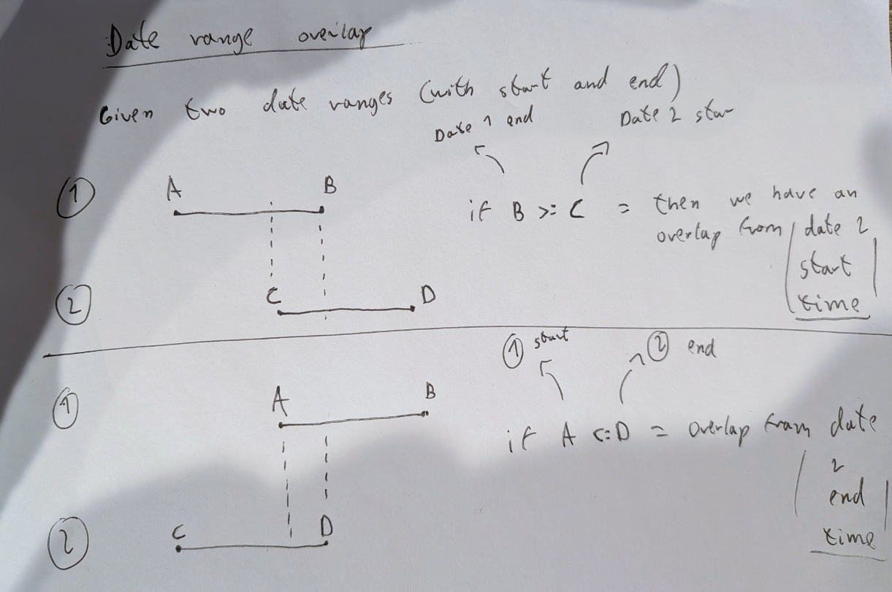

# Table of contents

- [Week 1](#week-1)
- [Week 2](#week-2)
- [Week 3](#week-3)
- [Week 4](#week-4)
- [Week 5](#week-5)

# Week 1

🟢 On track | Yosmel Chiang posted an update on May 4

[7.Submission.pdf](https://uploads.linear.app/ed5668e0-e380-4530-a14e-97ba82128a49/5bb2ebd3-8ab2-43b0-8d13-7aad988d06cb/8c253265-6c6a-4a3a-bf60-436b39301f89)

[6.Documentation.pdf](https://uploads.linear.app/ed5668e0-e380-4530-a14e-97ba82128a49/49a41b1b-f0fb-454f-8023-de81bd58b617/4f4870c7-94ba-4ca4-b33f-66e13c0e84f6)

[5.Frontend.pdf](https://uploads.linear.app/ed5668e0-e380-4530-a14e-97ba82128a49/ee2f7358-b530-410d-8e1b-3a6bcdf13f8f/a6738d42-1d81-4b08-b992-60b7148771b2)

[4.Backend.pdf](https://uploads.linear.app/ed5668e0-e380-4530-a14e-97ba82128a49/215c0082-0ae2-48f3-8cc9-784361ec67da/fdebc5dc-8ecd-420d-bcac-8609c9d1dfca)

[3.Database.pdf](https://uploads.linear.app/ed5668e0-e380-4530-a14e-97ba82128a49/6c01a1f3-afab-4aa9-84b6-1dc2a5474ef6/80288d50-9bb9-46ae-906a-0a13b4cec431)

[2.Instructions.pdf](https://uploads.linear.app/ed5668e0-e380-4530-a14e-97ba82128a49/4260c06e-d8d7-42fc-a0bd-9c635ea286a2/dec604cb-e520-4908-8d68-59545329be83)

[1.Repository.pdf](https://uploads.linear.app/ed5668e0-e380-4530-a14e-97ba82128a49/55f727f8-68be-4fb7-9533-fa39a61fe299/4ce46370-2a70-490b-8601-1fad0289756c)

[0.Overview.pdf](https://uploads.linear.app/ed5668e0-e380-4530-a14e-97ba82128a49/682188d9-5602-4aae-a5e4-5bcae7b3c5a8/6f3c0099-cffa-4b4d-a508-f25a047391be)

The goal today is to just gather project files on brief, description and requirements and focus on what we are going to develop.

--- 

🟢 On track | Yosmel Chiang posted an update on May 5

Today I have worked on repetition, refreshing specifically on normalization. Since the project requires 3rd normal form. I made sure I fully got normalization covered before diving in to the database design.

---

🟢 On track | Yosmel Chiang posted an update on May 6

Today I finished the ERD, I added a status attribute to the appointments, and a city attribute to the clinic. Everything is in 3rd normal form.

---

🟢 On track | Yosmel Chiang posted an update on May 7

Today Im setting up the models in .NET Entity Framework Core.

Oppgaver

---

🟢 On track | Yosmel Chiang posted an update on May 7

Today I have:

* Configured ASP.NET Core Controllers with placeholder code.
* Im starting off by setting up a Postman collection, I havent configured Swagger yet, I just want to test my memory of setting up controllers and test each endpoint.

---

🟢 On track | Yosmel Chiang posted an update on May 8

I have configured the models in EF Core with:

* Constraints.
* Relationships.
* I used `mysqldump` and `dbdiagram.io` to reverse engineer implementation and ensure everything fits according to the ERD.

Challenges:
- If an attribute is previously set to nullable, we couldn't add a migration to change them to `NN`.
    - To solve this we had to drop the database and create a fresh migration, resulting in a loss of migration history. This is probably an issue that I will keep having while developing, so I wont bother caring about migration history for now.

---

🟢 On track | Yosmel Chiang posted an update on May 9

Today I have implemented:

* **Seeds:** Seed data for all models to work with during development.
* **Services:** CityServices that talks to the database and sends data to the CityController.
* **DTO:** DTO's for reading, creating and updating cities.
* **Extensions:** ServiceExtension for adding services to the DI container.
* **Controllers:** endpoints for each service method.
* **Contraints:** Unique contraints to prevent duplicates in the database.
* **ErrorHandler:** A global error handler to avoid writing try catches in every service.

---

🟢 On track | Yosmel Chiang posted an update on May 10

Today I have:

* **Swagger:** API documentation with `doc` as base endpoint.
* **XML Comments:** Configured XML comments with Swagger so we can add JSON examples and response codes.
* **Continuous Integration:** A simple GitHub action that builds the application on each push, this is to give me assurance that no commit has broken anything.
* **New features:** Specialties, Status, Categories and Doctor


# Week 2

🟢 On track | Yosmel Chiang posted an update on May 11

Today we have:

* **Implemented mappers:** We have come to the point where it getting messy with all these manual mapping from entity to DTO and DTO to entity. After some researching, I found a few options, one of them is using a package like AutoMapper, and the other is to implement extension methods. I have concluded not to go for another package such as Mapperly or Automapper, instead im going the "extension methods" route to abstract the mapping away from the services, this provides reusability and we have control of whats being used/mapped from the entity. I've already created Extensions for infrastructure dependency injection, so for now Im just going to collocate these mappings in the Extensions namespace. I might look into refactoring the project structure later on.
  * By outsourcing the work to mappers, we now encountered a new problem, my previous strategy of relying on`.Select` projection to load related data doesn't work unless its all in the same expression. For example, this works perfectly without having to add an `.Include `because its all in the same expression, EF core is smart enough to bring in the **Doctor** model for us since we are referring to it in the `.Select` projection.
  * 
    ```typescript
    .Select(a => new AppointmentWithDetailsDTO
    {
        Id = a.Id,
        Doctor = new DoctorDTO
        {
            Id = a.Doctor.Id,
            Name = a.Doctor.Name
        }
    })
    ```
  * However, when we instead refactored to this

    ```typescript
    .Select(appointment => appointment.ToAppointmentWithDetailsDTO())
    ```
  * It threw errors, because it wasn't able load related data, required by the DTO mapper, so to fix this we have to use `.Includes`.

* **Implemented the following features:** Appointment and Patient, with corresponding Services, Controllers, DTOS and finally Mappers

---


🟢 On track | Yosmel Chiang posted an update on May 12

Today I have:

* **Added new Features**: Clinic feature with services, controller, DTOS, mappers and swagger documentation:
* **Update mapper:** So far Ive been doing a lot of manual operation for updates, like this:

  ```
      public async Task<ClinicDTO?> UpdateClinic(int id, UpdateClinicDTO dto)
      {
          var existing = await _ctx.Clinics.FindAsync(id);
          if(existing == null) return null;
  
          existing.Name = dto.Name;
          existing.Phone = dto.Phone;
          existing.Email = dto.Email;
          existing.Address = dto.Address;
          existing.PostalCode = dto.PostalCode;
          existing.CityId = dto.CityId;
  
          await _ctx.SaveChangesAsync();
  
          return existing.ToClinicDTO();
      }
  ```

  This can be moved into a mapper, to keep the service clean and with less noise, also supporting partial updates, like so:

  ```
      public static void UpdateWith(this Clinic clinic, UpdateClinicDTO dto)
      {
          if(!string.IsNullOrWhiteSpace(dto.Name)) clinic.Name = dto.Name;
          if(!string.IsNullOrWhiteSpace(dto.Phone)) clinic.Phone = dto.Phone;
          if(!string.IsNullOrWhiteSpace(dto.Email)) clinic.Email = dto.Email;
          if(!string.IsNullOrWhiteSpace(dto.Address)) clinic.Address = dto.Address;
          if(!string.IsNullOrWhiteSpace(dto.PostalCode)) clinic.PostalCode = dto.PostalCode;
          if(dto.CityId > 0) clinic.CityId = dto.CityId;
      }
  ```

  Now the services becomes easier to read, and there is an abstraction:

  ```
      public async Task<ClinicDTO?> UpdateClinic(int id, UpdateClinicDTO dto)
      {
          var existing = await _ctx.Clinics.FindAsync(id);
          if(existing == null) return null;

          existing.UpdateWith(dto);

          await _ctx.SaveChangesAsync();

          return existing.ToClinicDTO();
      }
  ```
  Since this approach is cleaner, Im updating the rest of the services with this method.

* **Domain:** We changed the attribute data type of NationalIdentityNumber for Patients to string instead of int due to the fact that we want to mimic a norwegian identity number, which consists of at min/max 11 character long. Since we are not doing calculations with this value, we concluded by going with a string data type.
* **CORS:** We have implemented CORS configuration to allow AnyHeaders, AnyMethods and AnyOrigins, since this is for a school project, Im setting it as a default policy to keep things simple.

---

🟢 On track | Yosmel Chiang posted an update on May 15

Caught a flu, so theres been slow progress, but so far I have:

* **Implemented authentication rules for the backend**, using JWT tokens to extract the PatientId claim for creates and updates when authenticated. For non-authenticated users, they must provide the PatientId when creating an appointment. Im thinking the flow goes like this:
  * The frontend creates a patient user with minimal data, such as Firstname, Lastname and phone number (will probably add birth day aswell, I saw that the requirements ask for it)
  * The frontend uses the created patientId to create an appointment, providing the rest of the required data, such as doctor id and so on…
  * Im not sure this approach is solid, but the im sure the end result will surface flaws, which we will assess when they show up.
* **Doctor search endpoint:** added a search for doctors using Linq

---

🟢 On track | Yosmel Chiang posted an update on May 17

Still on the flu, slow progress, but im moving forward regardless.

Today I have worked on:

* **Started working on the frontend:** Laid out the layout, router infrastructure and basic navigation
* **Setup the api services:** Implemented API services towards different endpoints, all endpoints are stored in .env variables and retrieved using `import.meta.env.VITE_SOME_API_URL`. On each API service im doing a check against a particular url, to make sure they are present in the .env file.
* **Zustand**: I decided to work with zustand because of how simple it is to work with. The idea is simple, create a store for specific states, either it is doctors, patients, categories whatever, and provide a fetch function through zustand to get data from the backend through the correct api service.
* **Search page:** The search page is now fully functional, while it doesnt look super pretty yet, one can easily look up doctors and get results, or no match if no match is found.
* **BookingPage for guests:** I decided to check this one off first before moving on to authentication. For now im just focused on implementing the logic behind creating an appointment with basic non-sensitive data for anyone that is not registered. The idea is the following, create a patient first (using a zustand store) and use that patient id to create an appointment. On the backend I have implemented logic such that if the patient firstname and lastname already exists, we use that entity instead of creating a new one, to avoid a bunch of records with the same firstname and lastname, I have not bothered going further as of preventing duplicate phone numbers, thatll be too much over-engineering, I mean it is more likely that a returning patient changes their phone number and not their firstname and lastname…
* **PreventingOverlapping time slots:** This one was tricky to implement, because I did not think of it earlier, however I do have **isUnique** constraints on the backend:

  ```
   // This contraints prevents Appointments to be created at the same time with the same Doctor
  modelBuilder.Entity<Appointment>().HasIndex(c => new { c.DoctorId, c.AppointmentDate}).IsUnique();
          
  // This contraints prevents Appointments to be created at the same time by the same Patient
  modelBuilder.Entity<Appointment>().HasIndex(c => new { c.PatientId, c.AppointmentDate}).IsUnique();
  ```

But these only account for cases where a Doctor cannot have two appointments at the exact same DateTime value, same for a Patient. What it does not account of is wether an existing appointment time on a doctor ends AFTER a new appoitment. Thats an overlap that needs to be addressed. So I did some searching on this and of course stackoverflow had some good answers, but one in particular helped me understand this, this one was linked referenced on stackoverflow: [https://baodad.blogspot.com/2014/06/date-range-overlap.html](<https://baodad.blogspot.com/2014/06/date-range-overlap.html>), Its not much of an explanation post, but a picture of a piece of paper and a drawing with a visualization. I had to draw one version myself to get it 100%. 

So we implemented this check, tested it on the backend + frontend and works perfectly. Currently its only present for creating appointments, but considering a registered patient will be able to update existing patients, there must be a check of the same sort for appointment updates, Ill adress that when I get to that part.

* **Sonner:** I was satisfied with how simple sonner toasts works in the previous CA, specifically toast.promise. So I installed it for this project and implemented it for visual feedback. Im also using zod for simple validation and showing error messages.


# Week 3
# Week 4
# Week 5